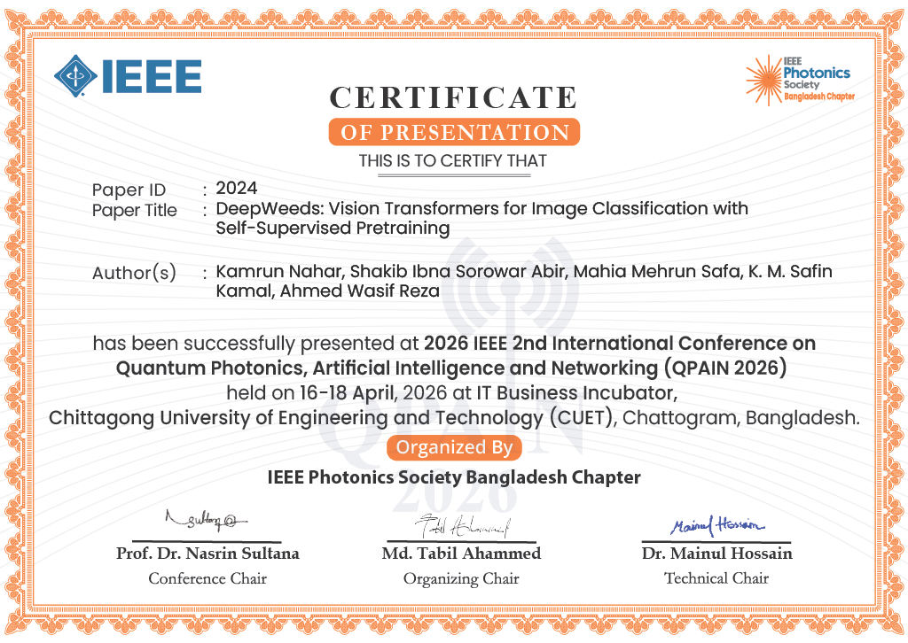
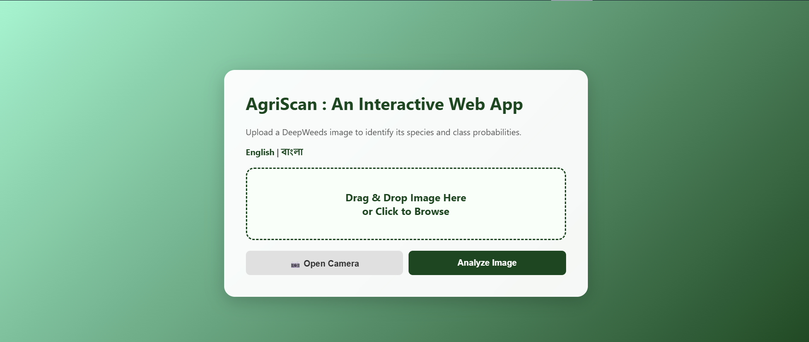
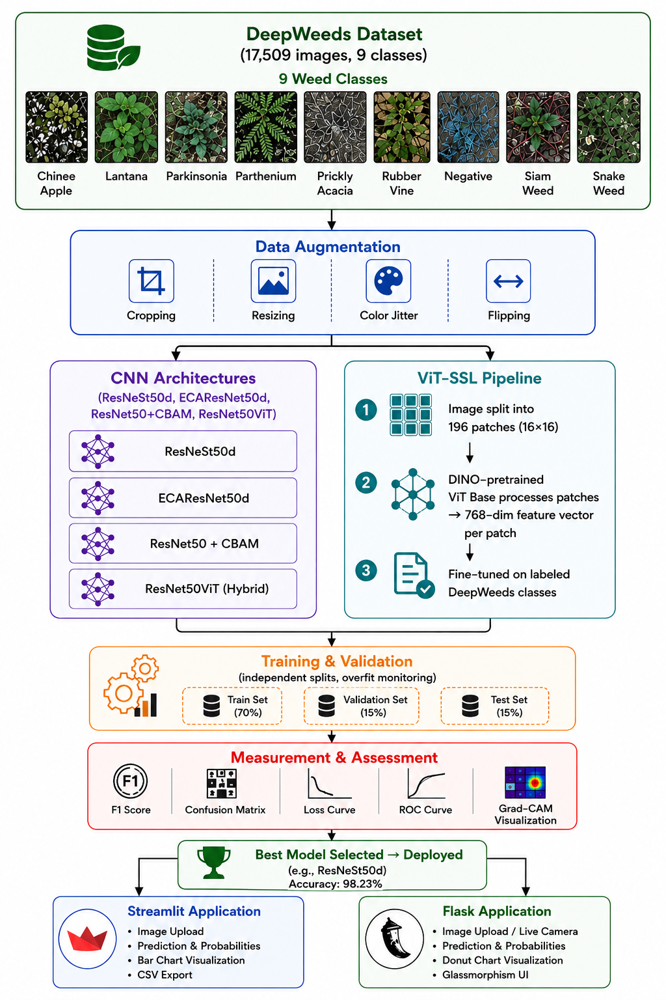
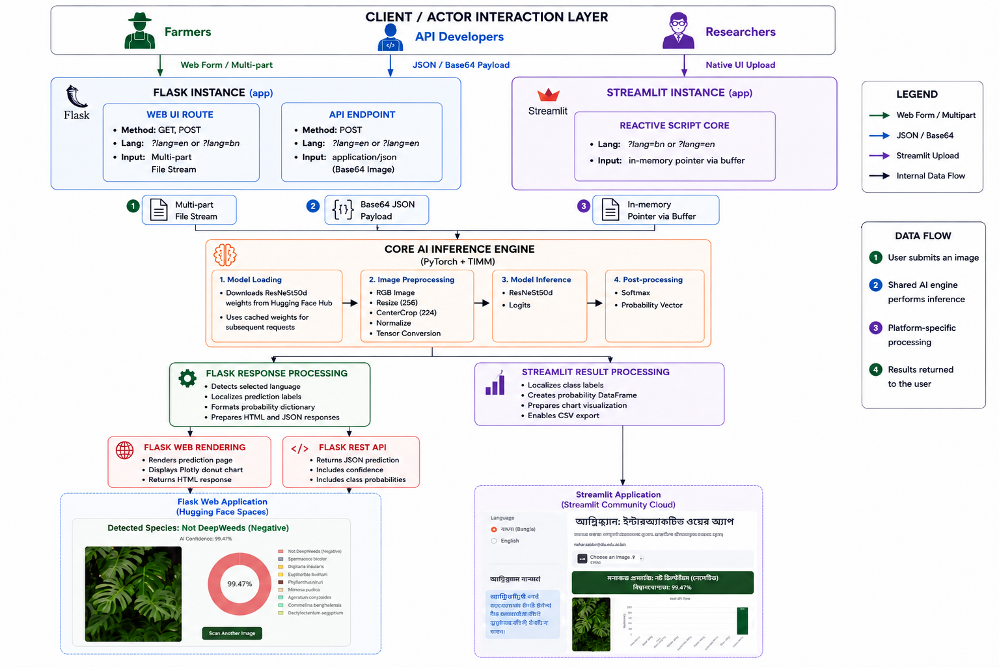

<div align="center">

# 🌿 AgriScan: An Interactive Web Application

### Vision Transformers with Self-Supervised Pretraining vs. CNN Architectures for Precision Agriculture

*A research-driven deep learning system for automated invasive weed classification using comparative CNN and Vision Transformer architectures.*


<div align="center">

[](https://ieeexplore.ieee.org/abstract/document/11545838)
[](https://agriscan-deepweeds-deploy.streamlit.app/)
[](https://huggingface.co/spaces/Jaoooooo9/agriscan-interactive-web-app-flask-edition)
[](Jaoooooo9/agriscan-interactive-web-app-flask-edition)

</div>

</div>
---
# 📄 Publication

The research presented in this repository has been published in an IEEE international conference, 2026 IEEE 2nd International Conference on Quantum Photonics, Artificial Intelligence & Networking (QPAIN), 16-18 April 2026.

**DOI**

```text
10.1109/QPAIN69676.2026.11545838
```

---

# 🏅 Recognition

**IEEE QPAIN 2026 — Paper Presentation Certificate**

<div align="center">



</div>


---

# 🔗 Live Demo


| Application | Access |
| :--- | :--- |
| 🎛️ **Streamlit Dashboard** | [Launch Dashboard](https://agriscan-deepweeds-deploy.streamlit.app/) |
| 📱 **Flask Web Application** | [Open Web Application](https://huggingface.co/spaces/Jaoooooo9/agriscan-interactive-web-app-flask-edition) |
| 📄 **IEEE Publication** | [IEEE Xplore](https://ieeexplore.ieee.org/abstract/document/11545838) • [DOI](https://doi.org/10.1109/QPAIN69676.2026.11545838) |


### 🚀 Try the Live Classifier

<div align="center">

[](https://huggingface.co/spaces/Jaoooooo9/agriscan-interactive-web-app-flask-edition)

</div>

---

# 🌱 Project Overview

- **The problem:** Deepweeds misidentification is a real cost in agriculture; it leads to crop damage, wasted herbicide, higher production costs, and lower yields. Traditional identification depends on botanical expertise and manual field inspection, which doesn't scale well for most farmers and practitioners.

- **The approach:** AgriScan runs a proper comparative evaluation of four CNN architectures against a Vision Transformer pretrained with DINO self-supervised learning, all trained and tested under identical conditions on the DeepWeeds dataset for a fair, apples-to-apples comparison.

- **How performance was judged:** The evaluation goes beyond a single accuracy number, covering precision, recall, F1-score, ROC analysis, confusion matrices, and Grad-CAM visualizations to understand not just how well each model performs, but how and why.

- **The winner:** ResNeSt50d came out on top with 98.23% classification accuracy.

- **From research to real-world tool:** The best model was deployed as two complementary applications suited to different users:
   - A Streamlit dashboard for researchers and analysts who want to explore the data and results in depth.
   - A Flask web app built for farmers and field workers, complete with live camera capture for on-the-spot identification.


---

# ✨ Key Features

### 🤖 Deep Learning Research

- Comparative evaluation of **five deep learning architectures** under identical experimental conditions.
- Evaluation of a **DINO self-supervised Vision Transformer** alongside established CNN architectures.
- Comprehensive performance assessment using multiple quantitative and qualitative evaluation metrics.
- Grad-CAM–based interpretability analysis to visualize model decision regions.
- Selection of the best-performing model for deployment based on experimental evidence.

---

### 🌾 Deepweeds Classification

- Detection of **eight invasive weed species** and one **Negative (background)** class.
- Designed for realistic field environments with varying lighting and background conditions.
- Supports automated weed identification for precision agriculture applications.

---

### 💻 Interactive Applications

- Research-oriented **Streamlit dashboard**.
- Mobile-friendly **Streamlit dashboard** & **Flask web application**.
- Browser-based **live camera capture**.
- Standard image upload.
- Interactive probability visualization.
- CSV report generation.
- Responsive user interface.

---

### 🌍 Accessibility

- Full bilingual interface (**English / বাংলা**).
- Shared AI inference engine across both applications.
- Model hosted through Hugging Face Hub.
- Cross-platform deployment accessible from desktop and mobile devices.

---

### 📊 Research Contributions

- Controlled comparison between CNN and Vision Transformer architectures.
- Investigation of self-supervised pretraining for agricultural image classification.
- Reproducible evaluation methodology.
- Deployment of the best-performing model into real-world applications.
- Published IEEE conference paper describing the complete research workflow.

---

## 🏗️ System Architecture & Pipeline Overview

<div align="center">



*Figure 1: Schematic overview of the AgriScan deep learning pipeline for DeepWeeds classification and deployment.*

</div>

---

## Overview

The complete end-to-end pipeline followed throughout this study is structured as follows:

* **Dataset Selection:** Utilized the **DeepWeeds** dataset as the foundation for the entire pipeline.
* **Data Augmentation:** Applied a consistent image augmentation process across all samples to maintain data uniformity.
* **Model Training:** Trained five distinct deep learning architectures under identical experimental settings and hyperparameter configurations.
* **Standardized Evaluation:** Fine-tuned each model and combined quantitative evaluation with qualitative interpretability analysis to ensure a fair comparison.
* **Model Selection:** Identified and selected **ResNeSt50d** as the highest-performing architecture.
* **Deployment:** Integrated the finalized **ResNeSt50d** model into both a **Streamlit dashboard** and a **Flask web application** for end-user accessibility.


---

# 🌾 Dataset
## Dataset Citation

### IEEE Citation

> A. Olsen, D. A. Konovalov, B. Philippa, P. Ridd, J. C. Wood, J. Johns, W. Banks, B. Girgenti, O. Kenny, J. Whinney, B. Calvert, M. Rahimi Azghadi, and R. D. White, "DeepWeeds: A Multiclass Weed Species Image Dataset for Deep Learning," *Scientific Reports*, vol. 9, no. 2058, 2019.

### BibTeX

```bibtex
@article{DeepWeeds2019,
  author = {Alex Olsen and Dmitry A. Konovalov and Bronson Philippa and Peter Ridd and Jake C. Wood and Jamie Johns and Wesley Banks and Benjamin Girgenti and Owen Kenny and James Whinney and Brendan Calvert and Mostafa {Rahimi Azghadi} and Ronald D. White},
  title = {DeepWeeds: A Multiclass Weed Species Image Dataset for Deep Learning},
  journal = {Scientific Reports},
  volume = {9},
  number = {2058},
  year = {2019},
  doi = {10.1038/s41598-018-38343-3}
}
```

---

## Dataset Overview

| Property | Description |
|-----------|-------------|
| **Dataset** | DeepWeeds |
| **Total Images** | 17,509 |
| **Number of Classes** | 9 |
| **Target Classes** | 8 invasive weed species + 1 Negative class |
| **Image Type** | RGB field photographs |
| **Environment** | Natural agricultural and pastoral environments |
| **Primary Task** | Multi-class image classification |

---

## Deepweeds Categories

The dataset consists of eight invasive weed species together with one **Negative** class. Including a background class enables the model to distinguish target weeds from ordinary vegetation, soil, and other non-target objects, reducing false-positive predictions during real-world deployment.

| Class | Botanical Name | Description |
|--------|----------------|-------------|
| **Chinee Apple** | *Ziziphus mauritiana* | Invasive shrub/tree species |
| **Lantana** | *Lantana camara* | Toxic invasive shrub |
| **Parkinsonia** | *Parkinsonia aculeata* | Thorny invasive tree |
| **Parthenium** | *Parthenium hysterophorus* | Highly invasive agricultural weed |
| **Prickly Acacia** | *Vachellia nilotica* | Thorn-forming invasive tree |
| **Rubber Vine** | *Cryptostegia grandiflora* | Smothering climbing vine |
| **Siam Weed** | *Chromolaena odorata* | Fast-growing perennial shrub |
| **Snake Weed** | *Stachytarpheta jamaicensis* | Herbaceous invasive weed |
| **Negative** | N/A | Background vegetation, soil, and non-target plants |

---

## Data Preparation

Before model training, all images were processed using a consistent preprocessing and augmentation pipeline to improve model robustness and reduce overfitting. Every architecture received the same processed dataset to ensure experimental fairness.

### Image Preprocessing

- Image resizing
- Center cropping
- Tensor conversion
- Image normalization

### Data Augmentation

- Random cropping
- Random horizontal flipping
- Color jitter
- Image resizing


---


## 📊 Evaluation Metrics

The following evaluation criteria were used throughout the comparative study.

| Category | Metrics |
|-----------|---------|
| **Classification Performance** | Accuracy, Precision, Recall, F1-score |
| **Class-wise Performance** | Per-class Precision, Recall, F1-score |
| **Visual Evaluation** | Confusion Matrix, ROC Curve |
| **Training Behaviour** | Accuracy & Loss Curves |
| **Model Interpretability** | Grad-CAM |

---

# 🏆 Model Comparison Results

The table below summarizes the overall performance achieved by each architecture under identical experimental conditions.

| Model | Architecture | Accuracy | Precision | Recall | Macro F1 |
|--------|--------------|----------|-----------|--------|----------|
| 🥇 **ResNeSt50d** | CNN (Split Attention) | **98.23%** | **98.0%** | **98.0%** | **98.0%** |
| ECAResNet50d | CNN (Efficient Channel Attention) | 96.38% | 96.0% | 94.0% | 95.0% |
| ViT Base Patch16 224 DINO | Vision Transformer (Self-Supervised) | 94.00% | 91.0% | 91.0% | 91.0% |
| ResNet50ViT | CNN + Vision Transformer Hybrid | 93.00% | 90.0% | 91.0% | 90.0% |
| ResNet50 + CBAM | CNN (Attention Module) | 87.00% | 80.0% | 90.0% | 84.0% |


---

# 🧬 Detailed Model Configuration

The table below documents the complete training configuration for each architecture, ensuring full reproducibility of the comparative study.

| Property | ResNeSt50d | ECAResNet50d | ResNet50 + CBAM | ResNet50ViT | ViT-B/16 (DINO) |
|:---|:---|:---|:---|:---|:---|
| **Framework** | PyTorch + TIMM | PyTorch + TIMM | TensorFlow / Keras | TensorFlow / Keras | PyTorch + TIMM + Hugging Face |
| **Training Platform** | Kaggle Notebook | Kaggle Notebook | Kaggle Notebook | Kaggle Notebook | Kaggle Notebook |
| **Hardware** | NVIDIA Tesla P100 GPU | NVIDIA Tesla P100 GPU | NVIDIA Tesla P100 GPU | NVIDIA Tesla P100 GPU | NVIDIA Tesla P100 GPU |
| **CUDA Acceleration** | Yes | Yes | Yes | Yes | Yes |
| **Backbone** | ResNeSt50d | ECAResNet50d | ResNet50 | ResNet50 | ViT-Base Patch16/224 |
| **Attention Mechanism** | Split-Attention | Efficient Channel Attention (ECA) | CBAM (Channel + Spatial) | Transformer Encoder | Multi-Head Self-Attention |
| **Transformer Depth** | — | — | — | 2 Encoder Blocks | 12 Encoder Blocks |
| **Attention Heads** | — | — | — | 4 | 12 |
| **Embedding Dimension** | — | — | — | 256 | 768 |
| **MLP Dimension** | — | — | — | 512 | 3072 |
| **Positional Encoding** | — | — | — | Learnable Positional Embedding | Learnable Positional Embedding |
| **Pooling Strategy** | Global Average Pooling | Global Average Pooling | Global Average Pooling | Global Average Token Pooling | [CLS] Token |
| **Pretraining** | ImageNet | ImageNet | ImageNet | ImageNet | DINO Self-Supervised Pretraining |
| **Transfer Learning Strategy** | End-to-End Fine-tuning | End-to-End Fine-tuning | Freeze Backbone → Unfreeze Last 20 Layers | Freeze Backbone → Unfreeze Last 20 Layers | Full Fine-tuning after Self-Supervised Pretraining |
| **Input Resolution** | 224 × 224 | 224 × 224 | 224 × 224 | 224 × 224 | 224 × 224 |
| **Batch Size** | 32 | 32 | 32 | 32 | 32 (Fine-tuning), 16 (Pretraining, Effective 32 via Gradient Accumulation) |
| **Epochs** | 50 | 50 | 50 | 55 | 110 (Pretraining) + 50 (Fine-tuning) |
| **Optimizer** | AdamW | AdamW | Adam | Adam | AdamW |
| **Learning Rate** | 1×10⁻⁴ | 1×10⁻⁴ | 5×10⁻⁴ → 1×10⁻⁴ | 5×10⁻⁴ → 1×10⁻⁴ | 1×10⁻² (Pretraining), 1×10⁻⁵ (Fine-tuning) |
| **Weight Decay** | 0.01 | 0.01 | None | None | 0.05 |
| **Scheduler** | Cosine Annealing LR | Cosine Annealing LR | None | None | Cosine Annealing LR |
| **Loss Function** | CrossEntropyLoss | CrossEntropyLoss | Categorical Crossentropy | Categorical Crossentropy | CrossEntropyLoss |
| **Class Weighting** | None | None | Yes | None | None |
| **Classifier Head** | TIMM Linear Head | TIMM Linear Head | Dense(1024) → Dense(512) + Dropout | Dense(1024) → Dense(512) + Dropout | Linear Classification Head |
| **Dropout** | None | None | 0.30 | 0.30 | None |
| **Mixed Precision** | CUDA AMP | CUDA AMP | No | No | CUDA AMP |
| **Gradient Accumulation** | No | No | No | No | Yes (Pretraining Only) |
| **Early Stopping** | Patience = 5 | Patience = 5 | None | None | Patience = 10 |
| **Data Augmentation** | RandomResizedCrop, H-Flip, TrivialAugmentWide | RandomResizedCrop, H-Flip, TrivialAugmentWide | ImageDataGenerator Augmentation | ImageDataGenerator Augmentation | Multi-Crop, CLAHE, RandomResizedCrop, H-Flip, ColorJitter, Gaussian Blur, Random Grayscale |
| **Normalization** | ImageNet Mean & Std | ImageNet Mean & Std | ImageNet Mean & Std | ImageNet Mean & Std | ImageNet Mean & Std |

### Experimental Environment

```
Platform          : Kaggle Notebook
GPU               : NVIDIA Tesla P100 (16 GB)
Frameworks        : PyTorch 2.x, TIMM, Hugging Face Transformers, TensorFlow/Keras
CUDA              : Enabled
Mixed Precision   : CUDA AMP (PyTorch models only)
Operating System  : Windows-10 (Kaggle Runtime)
```
---

## 📖 Performance Analysis & Key Findings

* **ResNeSt50d Performance:** Achieved **98.23% classification accuracy** while maintaining balanced precision, recall, and macro F1-score.
* **Feature Extraction:** The split-attention mechanism successfully captures fine-grained features to distinguish visually similar weed species in real-world conditions.
* **Transformer Results:** **ViT Base Patch16 224 DINO** reached **94.00%**, outperforming the CNN-Transformer hybrid (`ResNet50ViT`).
* **Pretraining Advantage:** DINO self-supervised pretraining provides a measurable performance boost over models initialized without it.
* **Architectural Suitability:** CNNs remain better suited for the moderate-sized DeepWeeds dataset due to their inherent spatial inductive biases.
* **Dataset Scale Limitations:** Vision Transformers require substantially larger training datasets before consistently surpassing advanced convolutional models.
* **Experimental Rigor:** All models were evaluated under identical conditions to ensure a fair and unbiased comparison.
* **Model Interpretability:** Grad-CAM visualizations confirmed that the models focused accurately on biologically meaningful plant structures rather than background noise.

---

# 🔍 Model Interpretability

Accurate predictions alone are insufficient for trustworthy AI systems. To better understand how each architecture reached its predictions, Grad-CAM (Gradient-weighted Class Activation Mapping) was applied across all evaluated models.

Grad-CAM generates visual explanations by highlighting the image regions that contribute most strongly to the model's prediction. These visualizations provide additional evidence that the classifier is learning meaningful botanical characteristics rather than relying on irrelevant background features.

Across the comparative study, **ResNeSt50d** consistently produced the most localized and biologically relevant activation maps, reinforcing the quantitative evaluation results and providing greater confidence in its suitability for deployment within practical agricultural applications.

---

## 📌 Experimental Summary

The experimental evaluation demonstrates that the proposed comparative framework successfully identified the most effective architecture for invasive weed classification on the DeepWeeds dataset. While self-supervised Vision Transformers showed promising performance and benefited substantially from DINO pretraining, the split-attention ResNeSt50d architecture achieved the best overall balance of accuracy, robustness, and interpretability. Consequently, ResNeSt50d was selected as the production model for deployment in the AgriScan web applications.

---

# 🚀 Deployment Architecture

<div align="center">



**Figure 2.** Shared deployment architecture illustrating how both web applications utilize the same trained ResNeSt50d inference engine while providing different user experiences.

</div>

---

## Overview

Following experimental evaluation, the highest-performing architecture (**ResNeSt50d**) was selected for deployment as the production model. Rather than developing separate machine learning models for different interfaces, AgriScan adopts a **shared inference architecture**, where both deployed applications use the same trained model and prediction pipeline.

Although the **Streamlit Dashboard** and **Flask Web Application** provide different user experiences, they perform identical preprocessing, inference, and prediction operations. This design guarantees consistent classification results regardless of which application is used while simplifying model maintenance and future updates.

The trained model is hosted on **Hugging Face Hub**, allowing both applications to automatically retrieve the latest production model during startup without requiring manual distribution of model weights.

---

# 💻 Deployed Applications

AgriScan provides two independent applications designed for different user groups while sharing the same AI inference engine.

## 🎛️ Streamlit Dashboard

The Streamlit application is intended for researchers, students, agricultural analysts, and demonstration purposes. It provides an interactive dashboard for exploring model predictions and exporting classification results.

### Features

- Image upload interface
- Interactive probability visualization
- Prediction confidence display
- Downloadable CSV prediction reports
- Bilingual interface (English / Bangla)
- Responsive dashboard layout
- Automatic model loading from Hugging Face Hub

---

## 📱 Flask Web Application

The Flask application is designed primarily for practical field use, enabling users to identify weeds directly from smartphones or other mobile devices without installing a dedicated application.

### Features

- Image upload
- Browser-based live camera capture
- Mobile-friendly interface
- Interactive confidence visualization
- REST API support
- Bilingual interface (English / Bangla)
- Automatic model loading from Hugging Face Hub

---

# ⚙️ Shared AI Inference Engine On The Dashboards

Both deployed applications rely on the same production inference pipeline to ensure identical prediction behaviour across platforms.

| Stage | Description |
|--------|-------------|
| **Model Loading** | Downloads the trained ResNeSt50d model from Hugging Face Hub during application startup. |
| **Image Preprocessing** | Resizes, crops, converts, and normalizes input images before inference. |
| **Model Inference** | Performs forward propagation using the trained PyTorch model. |
| **Probability Estimation** | Applies Softmax to generate confidence scores for all nine classes. |
| **Prediction Output** | Returns the predicted weed species together with class probabilities for presentation within each application. |

---

# 🔄 Shared Deployment Workflow

Although the Streamlit dashboard and Flask application provide different interfaces, both applications execute the same prediction pipeline.

```text
User Input
(Image Upload / Camera Capture)
              │
              ▼
Image Preprocessing
              │
              ▼
Shared ResNeSt50d Model
              │
              ▼
Softmax Probability Calculation
              │
              ▼
Prediction Results
              │
      ┌───────┴────────┐
      ▼                ▼
Streamlit UI      Flask UI
```

---
# 🌍 Real-World Applications

Although AgriScan was developed as a comparative deep learning research project, its architecture and deployment strategy make it suitable for practical agricultural applications. By combining high-accuracy image classification with accessible web interfaces, the system demonstrates how modern artificial intelligence can assist farmers, researchers, and agricultural organizations in improving weed management and decision-making.

Potential application areas include:

- Precision agriculture and smart farming
- Early detection of invasive weed species
- Crop monitoring and field inspection
- Mobile-assisted weed identification
- Future drone-based agricultural monitoring
- Agricultural AI research and education
- Teaching computer vision and deep learning concepts
- Environmental and ecological monitoring

---


# 🚀 Future Work

Several extensions can further improve the capabilities of AgriScan.

### Model Improvements

- Train on larger and more diverse agricultural datasets.
- Investigate newer Vision Transformer architectures.
- Explore ensemble learning between CNN and Transformer models.
- Apply model compression and quantization for faster inference.

---

### Application Improvements

- Native Android and iOS applications.
- Offline inference for remote agricultural environments.
- Cloud-based REST API for third-party integration.
- Multi-image batch prediction.
- User account management and prediction history.

---

### Research Directions

- Weed detection using object detection frameworks.
- Semantic segmentation for dense weed localization.
- Multi-label agricultural disease classification.
- Drone and UAV image analysis.
- Continual learning for newly emerging weed species.

---

# 🛠️ Technology Stack

AgriScan combines modern deep learning frameworks, web technologies, and cloud deployment platforms to provide an end-to-end research and deployment pipeline.


---

## 🎛️ Streamlit Dashboard

| Category | Technology |
|----------|------------|
| **Programming Language** | Python, CSS |
| **Framework** | Streamlit |
| **Inference Engine** | PyTorch |
| **Model Library** | TIMM |
| **Visualization** | Plotly Express |
| **Data Processing** | Pandas |
| **Image Processing** | Pillow |
| **Model Hosting** | Hugging Face Hub |
| **Deployment Platform** | Streamlit Community Cloud |
| **Localization** | English / Bangla |

---

## 📱 Flask Web Application

| Category | Technology |
|----------|------------|
| **Programming Language** | Python, HTML, CSS |
| **Framework** | Flask |
| **Inference Engine** | PyTorch |
| **Model Library** | TIMM |
| **Image Processing** | Pillow |
| **Visualization** | Plotly.js |
| **Camera Integration** | Browser MediaDevices API |
| **Model Hosting** | Hugging Face Hub |
| **Deployment Platform** | Hugging Face Spaces |
| **Localization** | English / Bangla |

---

## ☁️ Deployment Services

| Service | Purpose |
|----------|---------|
| **Hugging Face Hub** | Model weight hosting |
| **Hugging Face Spaces** | Flask application deployment |
| **Streamlit Community Cloud** | Dashboard deployment |
| **GitHub** | Source code management |

---


# ⚡ Installation

The following instructions allow you to run both AgriScan applications locally.

---

## 1️⃣ Clone the Repository

```bash
git clone https://github.com/chihiihii71/agriscan-deepweeds.git

cd agriscan-deepweeds
```

---

## 2️⃣ Create a Virtual Environment (Recommended)

### Windows

```bash
python -m venv venv

venv\Scripts\activate
```

### Linux / macOS

```bash
python3 -m venv venv

source venv/bin/activate
```

---

## 3️⃣ Install Dependencies

### Streamlit Dashboard

```bash
pip install streamlit \
torch \
torchvision \
timm \
pandas \
plotly \
Pillow \
huggingface_hub
```

---

### Flask Web Application

```bash
pip install flask \
torch \
torchvision \
timm \
Pillow \
huggingface_hub
```

---

## 4️⃣ Run the Streamlit Dashboard

```bash
streamlit run app.py
```

---

## 5️⃣ Run the Flask Application

```bash
python app.py
```


---

# 📂 Project Structure


```text
agriscan-deepweeds/

│
├── 📁 streamlit_app/
│   └── app.py
│
├── 📁 flask_app/
│   ├── app.py
│   ├── templates/
│   │      ├── index.html
│   │      └── result.html
│   │
│   └── static/
│          └── style.css
│
├── 📁 research/
│   ├── grad-cam.ipynb
│   ├── model_training.ipynb
│   └── evaluation.ipynb
│
├── 📁 docs/
│   ├── agriscan_research_pipeline.png
│   ├── agriscan_deployment_architecture.png
│   └── screenshots/
│
├── README.md
│
├── requirements.txt
```

---


# 📚 Citation

If you use this repository, the trained models, or the accompanying methodology in your research, please cite our work.

```bibtex
@INPROCEEDINGS{11545838,
  author={Nahar, Kamrun and Abir, Shakib Ibna Sorowar and Safa, Mahia Mehrun and Kamal, K. M. Safin and Reza, Ahmed Wasif},
  booktitle={2026 IEEE 2nd International Conference on Quantum Photonics, Artificial Intelligence & Networking (QPAIN)}, 
  title={DeepWeeds: Vision Transformers for Image Classification with Self-Supervised Pretraining}, 
  year={2026},
  volume={},
  number={},
  pages={1-6},
  keywords={Modeling;Accuracy;Deep learning;Industrial plants;Plants (biology);Printing;Labeling;Measurement;Convolutional neural networks;Training;DeepWeeds;Vision Transformers;ResNeSt50d;ECAResNet50d;ViT Base Patch16 224 Dino Model;Accuracy;F1-Score;ROC curve;Grad-CAM},
  doi={10.1109/QPAIN69676.2026.11545838}}
```


# 👨‍💻 Authors

| Author | Primary Contribution |
|:-------|:---------------------|
| **Kamrun Nahar** | Research, model development, implementation, experimentation, deployment, documentation. |
| **Shakib Ibna Sorowar Abir** | Manuscript writing, research assistance. |
| **Mahia Mehrun Safa** | Manuscript writing, research assistance, documentation. |
| **K. M. Safin Kamal** | Research supervision, technical guidance, manuscript review. |
| **Ahmed Wasif Reza** | Research supervision, project oversight. |
---

# 🙏 Acknowledgements

This project would not have been possible without the contributions of the following open-source communities and research initiatives.

### Dataset

- DeepWeeds Dataset

### Deep Learning

- PyTorch
- TIMM (PyTorch Image Models)

### Model Hosting

- Hugging Face Hub

### Web Frameworks

- Streamlit
- Flask

### Scientific Computing

- NumPy
- Pandas
- Scikit-learn
- Plotly
- Pillow

The authors also acknowledge the original DeepWeeds dataset creators and the maintainers of the open-source software used throughout this research.

---

<div align="center">

## ⭐ Support the Project

If you found AgriScan useful for your research, coursework, or agricultural applications, please consider giving this repository a **⭐ Star** on GitHub.

Your support helps improve the visibility of open-source research and encourages future development.

---

**Built with ❤️ using PyTorch, TIMM, Streamlit, Flask, and Hugging Face.**

</div>
